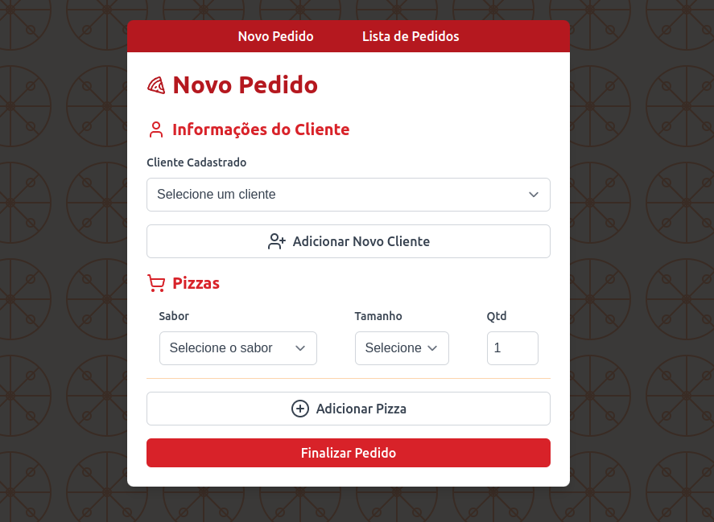
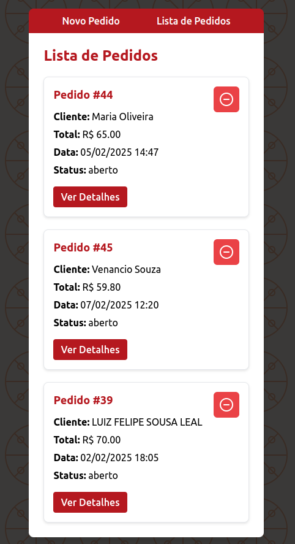

# Pizzaria Web System 🍕🍕 

Este é um sistema de controle para uma pizzaria de entrega em domicílio, desenvolvido com **React**, **TypeScript** e **Vite**. O sistema permite o cadastro de clientes, a realização de pedidos, o gerenciamento de pizzas (com diferentes tamanhos e sabores), e a visualização dos pedidos realizados.

## Tecnologias Utilizadas 🛠️

- **Frontend**:
  - [React](https://reactjs.org/) ⚛️
  - [TypeScript](https://www.typescriptlang.org/) 🔠
  - [Vite](https://vitejs.dev/) 🚀 (para build e servidor de desenvolvimento)
  - [React Router](https://reactrouter.com/) 🛣️
  - [Axios](https://axios-http.com/) 🌐 (para fazer chamadas HTTP)
  - [React Toastify](https://fkhadra.github.io/react-toastify/) 🔔 (para notificações)
  - [Lucide Icons](https://lucide.dev/) 🖼️ (para ícones)

- **Backend**:
  - API RESTful (baseada na URL `https://pizzariaapi-production.up.railway.app/`) 🌐

- **Banco de Dados**:
  - Relacional (Usado para armazenar informações sobre clientes, pizzas, pedidos, etc.) 🗄️

## Funcionalidades 🌟

### 1. **Cadastro de Clientes** 📝
O sistema permite cadastrar clientes com as informações de nome, telefone, endereço e bairro.

### 2. **Pedido de Pizzas** 🍕
Os atendentes podem fazer pedidos no sistema, associando um cliente a várias pizzas. As pizzas podem ter diferentes tamanhos (pequena, média ou grandes) e sabores, e o sistema calcula automaticamente o valor total do pedido.

### 3. **Visualização de Pedidos** 👁️
O sistema permite visualizar a lista de pedidos feitos, com detalhes do cliente, pizzas, valor total, data do pedido e status.

### 4. **Criação de Pedido** ➕🍕
O atendente pode adicionar itens ao pedido (pizzas com diferentes tamanhos e quantidades), editar as informações de sabor e quantidade, e finalizar o pedido.

## Como Rodar o Projeto 🚀

### 1. **Clonar o Repositório** 
```bash
  git clone https://github.com/usuario/pizzariaWeb


### 2. **Instalar Dependências**

```bash
  cd pizzariaWeb
  npm install
```

### 3. **Rodar Projeto**
```bash
  npm run dev
```

## Imagens Ilustrativas




**
**

## Link
  [Clique aqui para acessar o site](https://pizzaria-web-two.vercel.app/)
